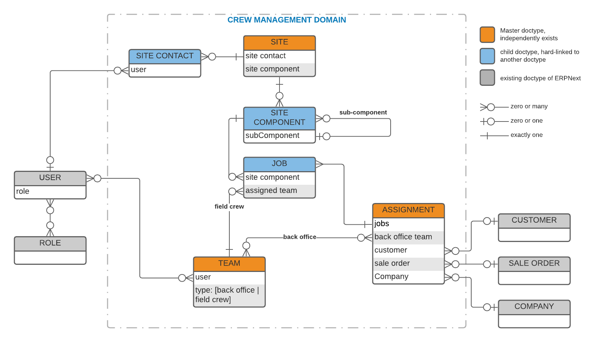

## Crew Management

An application for the management of  Field Installation technicians



## Local development environment setup

### On the host machine (your PC / laptop) 

```shell
cd <to/your/projects/directory>
git clone https://github.com/frappe/frappe_docker.git
cd frappe_docker
cp -R devcontainer-example .devcontainer
```

Edit file `.devcontainer/docker-compose.yml`, add the following line to the volume mappings of service `frappe`
```yaml
      - ~/.ssh:/home/frappe/.ssh
```

Having IntelliJ open the folder `frappe_docker` above

From IntelliJ, start the docker compose file `.devcontainer/docker-compose.yml`

### Inside the container of the service "frappe"
Open a terminal in the container of service "frappe". Inside that terminal, execute following commands

ALWAYS making your current directory inside the container is `/workspace/development`

```shell

cd /workspace/development

# Initialize using Frappe version 13
bench init --skip-redis-config-generation --frappe-branch version-13 frappe-bench
cd frappe-bench

bench set-mariadb-host mariadb
bench set-redis-cache-host redis-cache:6379
bench set-redis-queue-host redis-queue:6379
bench set-redis-socketio-host redis-socketio:6379

bench new-site z1n.local --mariadb-root-password 123 --admin-password admin --no-mariadb-socket

# Set the site into development mode
bench --site z1n.local set-config developer_mode 1
bench --site z1n.local clear-cache

# Install app ERPNext version 13
bench get-app --branch version-13 erpnext https://github.com/frappe/erpnext.git
bench --site z1n.local install-app erpnext
```

### Install Crew Management app

```shell
cd /workspace/development/frappe-bench
bench get-app --branch develop crew_management git@github.com:ZirrusOne/crew_management.git
bench --site z1n.local install-app crew_management
```

## Configure IntelliJ

### Setup remote python SDK
Right click on project root, Click=> Open Module Settings
* Platform Settings / SDKs => Add Python SDKs => Docker Compose:
  * Configuration file: `.devcontainer/docker-compose.yml`
  * Service: `frappe`
  * Python interpreter path: `/workspace/development/frappe-bench/env/bin/python`
* Project settings / Projects
  * Project SDK: select the SDK added above

### Import python modules
Right click on project root, Click=> Open Module Settings
* Project settings / Modules
  * (+) ==> Import Module => select folder: `development/frappe-bench/apps/frappe` => "Create module from external source"
  * Do the same for folder `development/frappe-bench/apps/erpnext`
  * Do the same for folder `development/frappe-bench/apps/crew_management`
  * Configure module dependency:
    * Select module `erpnext`
        * Select tab `Dependencies`
        * (+) => Module Dependency...
        * Select module `frappe`
    * Select module `crew_management`
      * Select tab `Dependencies`
      * (+) => Module Dependency...
      * Select module `frappe`

### Create frappe launch
Add a new run/debug configuration of type Python

* Name: frappe
* Scrip path:  ..... /development/frappe-bench/apps/frappe/frappe/utils/bench_helper.py
* Parameters: frappe serve --port 8000 --noreload --nothreading
* Environment variables:
  * PYTHONUNBUFFERED=1
  * DEV_SERVER=1
* Python interpreter: Choose the SDK added above
* Working directory: ...../development/frappe-bench/sites
* Path mapping:
  * Local: ...... /development/frappe-bench
  * Remote: /workspace/development/frappe-bench

### Launch the server
Now, whenever you want to run/debug the server side code, launch this.

Note that: when the app is running, to rerun, you need to stop the frappe container first.

### Access the admin facing of erpnext

[http://127.0.0.1:8000](http://127.0.0.1:8000)

Account: Administrator/admin


## To run migration
From inside frappe container terminal

```shell
cd /workspace/development/frappe-bench
bench --site z1n.local migrate
```

## To reinstall a site, wipe all data and start over

```shell
cd /workspace/development/frappe-bench
bench --site z1n.local reinstall --mariadb-root-password 123 --admin-password admin
bench --site z1n.local install-app erpnext
bench --site z1n.local install-app crew_management
```

## License

GNU GENERAL PUBLIC LICENSE

Version 3
